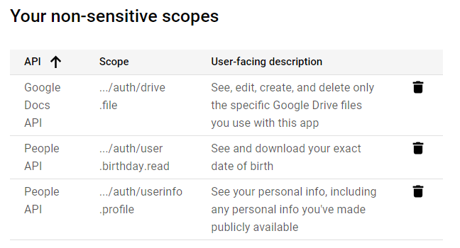
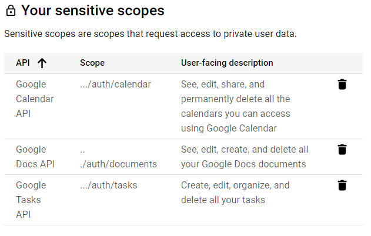
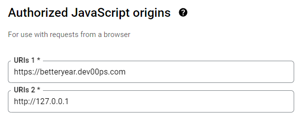
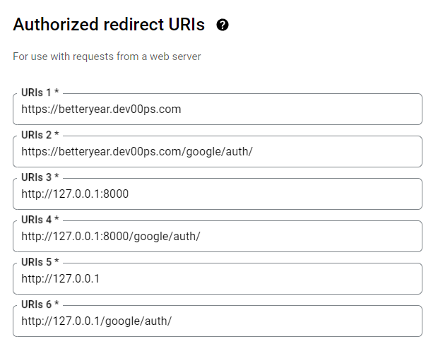

# Setup

### Google App Setup (sorta)

1. Create a New Google App Project [here](https://console.cloud.google.com/projectcreate)
2. Check to see if Oauth is enabled [here](https://console.cloud.google.com/apis/credentials)
    1. If Oauth is not enabled, edit the app [here](https://console.cloud.google.com/apis/credentials/consent)
    2. On the same page, while editing the app, click '*save and continue*'
4. Now add the following api scopes to your project if they are not already added
```
auth/user.birthday.read
auth/tasks
auth/drive
auth/drive.file
auth/documents
auth/calendar
auth/calendar.events
```




5. Click '*save and continue*'
6. If you would like multiple people to use your app, select '*+ add users*'
    1. Fill out the required user information
    2. Click '*save and continue*'
7. If the summary of the app looks good, then return to dashboard, otherwise, make necessary changes.
8. Add Authorized URLS to your Oauth
    1. Go to the credentials tab
    2. Click '*+ create credentials*' if you haven't already made new oauth credentials
    3. Click on your oauth client ID 
    4. Add urls that you plan to use for the project. Make sure to add a url with /google/auth/ for handling authentication. Also make sure to specify a port in your url if your plan on using a different port.

    
    
    

## Linux Commands

**Clone the repo and cd**
    
```bash
git clone https://github.com/gndpwnd/better_year
cd better_year
```

**Setup Environmental Variables**

```bash
export OUT_PORT=8000
export FN_CLIENT_ID = "REPLACE_WITH_YOUR_GOOGLE_OAUTH_ID.apps.googleusercontent.com"
export FN_CLIENT_SECRET = "REPLACE_WITH_YOUR_GOOGLE_OAUTH_SECRET"
export HOSTED_NAME="0.0.0.0"
export FN_AUTH_REDIRECT_URI = "http://${HOSTED_NAME}:${OUT_PORT}/google/auth"
export FN_BASE_URI = "http://${HOSTED_NAME}:${OUT_PORT}"
export FLASK_APP = "betteryear.py"
export FLASK_DEBUG = 1
export FN_FLASK_SECRET_KEY = "develdev"
```

**Build Docker Image**

```bash
docker build \
--build-arg OUT_PORT=${OUT_PORT} \
-t betteryear \
.
```

**Run App In Docker Container**

```bash
docker run \
-d \
-p ${OUT_PORT}:${OUT_PORT} \
--name betteryear_container \
--add-host=host.docker.internal:host-gateway \
-e OUT_PORT=${OUT_PORT} \
-e HOSTED_NAME=$HOSTED_NAME \
-e FN_AUTH_REDIRECT_URI=$FN_AUTH_REDIRECT_URI \
-e FN_BASE_URI=$FN_BASE_URI \
-e FN_CLIENT_ID=$FN_CLIENT_ID \
-e FN_CLIENT_SECRET=$FN_CLIENT_SECRET \
-e FLASK_APP=$FLASK_APP \
-e FLASK_DEBUG=$FLASK_DEBUG \
-e FN_FLASK_SECRET_KEY=$FN_FLASK_SECRET_KEY \
betteryear
```

If you have copied these commands, replacing only your google client info, you should be able to see the app [here](http://127.0.0.1:8000)

**Stop and Remove Docker Container**

```bash
docker stop betteryear_container
docker rm betteryear_container
docker rmi betteryear
```

## Windows Commands

**Clone the repo and cd**
    
```bash
git clone https://github.com/gndpwnd/better_year
cd better_year
```

**Set Environmental Variables**

```powershell
$env:OUT_PORT=8000
$env:HOSTED_NAME="0.0.0.0"
$env:FN_CLIENT_ID = "REPLACE_WITH_YOUR_GOOGLE_OAUTH_ID.apps.googleusercontent.com"
$env:FN_CLIENT_SECRET = "REPLACE_WITH_YOUR_GOOGLE_OAUTH_SECRET"
$env:FN_BASE_URI = "http://${env:HOSTED_NAME}:${env:OUT_PORT}"
$env:FN_AUTH_REDIRECT_URI = "http://${env:HOSTED_NAME}:${env:OUT_PORT}/google/auth"
$env:FLASK_APP = "betteryear.py"
$env:FLASK_DEBUG = 1
$env:FN_FLASK_SECRET_KEY = "develdev"
```

**Build Docker Image**

```powershell
docker build `
--build-arg OUT_PORT=${OUT_PORT} `
-t betteryear `
.
```

**Run App In Docker Container**

```powershell
docker run `
-d `
-p ${env:OUT_PORT}:${env:OUT_PORT} `
--name betteryear_container `
--add-host=host.docker.internal:host-gateway `
-e OUT_PORT=$env:OUT_PORT `
-e HOSTED_NAME=$env:HOSTED_NAME `
-e FN_AUTH_REDIRECT_URI=$env:FN_AUTH_REDIRECT_URI `
-e FN_BASE_URI=$env:FN_BASE_URI `
-e FN_CLIENT_ID=$env:FN_CLIENT_ID `
-e FN_CLIENT_SECRET=$env:FN_CLIENT_SECRET `
-e FLASK_APP=$env:FLASK_APP `
-e FLASK_DEBUG=$env:FLASK_DEBUG `
-e FN_FLASK_SECRET_KEY=$env:FN_FLASK_SECRET_KEY `
betteryear
```

If you have copied these commands, replacing only your google client info, you should be able to see the app [here](http://127.0.0.1:8000)

**Stop and Remove Docker Container**

```bash
docker stop betteryear_container
docker rm betteryear_container
docker rmi betteryear
```